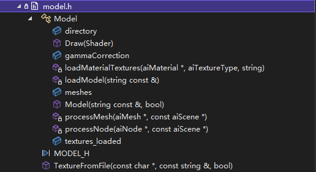

# 2022_bit_cg_opengl

本项目是BIT 2022年图形学课程的期末大作业。

开发环境：Microsoft Visual Studio 2022 + OpenGL

## 一、项目介绍

### 1、场景介绍

本项目为海面太阳高升的场景。天空上有飞机，海面上有小船，接近海平线有一座金碧辉煌的宝塔，并且位于远处的物体被雾所遮挡。

### 2、交互介绍

**1.鼠标移动**

鼠标移动可以直接控制视角。

**2.鼠标滚轮滑动**

鼠标滚轮滑动可以直接对场景进行放大或缩小。

**3.按键操作**

按键w(↑)、a(←)、s(↓)、d(→)分别控制视点向上、左、下、右移动。

### 3、引用的第三方库

- `glad`库：用于访问opengl的规范化接口的第三方库。
- `GLFW`库：用于图形、窗口、渲染等的第三方库。
- `glm`库：用于进行向量和矩阵的数学计算。
- `assimp`库：读取和加载obj模型
- `stb_image.h`：用于读取图片

### 4、代码介绍

1.游戏控制器`GameController.h`：用于鼠键交互的控制。

- `updateGameController(GLFWwindow* window) `：在GLFW渲染循环中调用，用于处理逐帧的操作

2.照相机`camera.h`：用于控制调整观察视点。

成员变量：

- Position：相机坐标

- Front：相机前朝向向量
- Up：相机上朝向向量
- Right：相机右朝向向量
- Pitch：相机俯仰角
- Yaw：相机摇动角

3.地面`Floor.h`：绘制地面，并贴图。

4.天空盒`skyboxcube.h`：绘制天空盒作为背景。

5.网格`mesh.h`：将读入的模型绑定在网格上，实现模型的绘制和贴图。

6.模型加载`model.h`：读取obj文件，并加载模型的顶点、面、法向量、纹理等，并绘制模型。

7.着色器`shader.h`：编译、链接顶点着色器和片段着色器。

8.纹理`texture.h`：加载和绑定纹理

## 二、XML类图及主要方法注释


## 三、具体技术方案

#### 1. 光照计算

采用冯氏光照模型，光照效果考虑环境光照、漫反射光照和镜面光照。

- **环境光**：我们采用一个系数ambient来乘以光源的颜色作为环境光

```opengl
// ambient
vec3 ambient = light.ambient * 
                texture(material.diffuse, TexCoords).rgb;
```

- **漫反射**：该部分用来模拟光源对物体的方向性影响，即物体越是正对光源的面越亮，通过法向量和光线方向（点的位置和光源的位置）来计算漫反射光

```opengl
// diffuse 
vec3 norm = normalize(Normal);
vec3 lightDir = normalize(light.position - FragPos);
float diff = max(dot(norm, lightDir), 0.0);
vec3 diffuse = light.diffuse * diff * 
                texture(material.diffuse, TexCoords).rgb;  
```

- **镜面反射**：该部分用来模拟光滑物体表面的高光，镜面反射的颜色更倾向于光照颜色

```opengl
// specular
vec3 viewDir = normalize(viewPos - FragPos);
vec3 reflectDir = reflect(-lightDir, norm);  
float spec = pow(max(dot(viewDir, reflectDir), 0.0), material.shininess);
vec3 specular = light.specular * spec * 
                texture(material.specular, TexCoords).rgb;
```


<center>phong光照模型效果</center>

- **光照的拓展部分：**

  - **近距离点光源高亮**：当相机位置距离点光源较近时，观察到的物体会出现局部点状高光，符合生活实际的点高光

  ```
  // spotlight (soft edges)
  float theta = dot(lightDir, normalize(-light.direction)); 
  float epsilon = (light.cutOff - light.outerCutOff);
  float intensity = clamp((theta - light.outerCutOff) 
                                / epsilon, 0.0, 1.0);
  diffuse  *= intensity;
  specular *= intensity;
  ```

  - **远距离光线稀释**：当物体离相机较远时，从光源打到物体后进入相机的光会被稀释，在实际生活中对应远距离的物体进入到人眼的光线不够强，我们在代码中通过光稀释来实现

  ```opengl
  // attenuation
  float distance    = length(light.position - FragPos);
  float attenuation = 1.0 / (light.constant + 
      light.linear * distance + light.quadratic * (distance * distance));    
  ambient  *= attenuation; 
  diffuse  *= attenuation;
  specular *= attenuation;  
  ```

  

  

<center>光照拓展效果</center>

可以看到图2中，远处的飞机显得较暗，而近处且离光线较近的飞机会更亮，这是由于光线稀释的效果。

#### 2. 使用库的模型导入

构建了model类用于读取模型文件，利用assimp第三方库提供好的接口得到顶点、纹理、面、法向量等模型信息，存储起来用于绘制。构建mesh类处理获得的模型文件，解析顶点、面、纹理信息，用相应的着色器进行绘制，可以得到如下的结果，模型的轮廓非常清晰。


<center>导入的飞机模型</center>



<center>模型Model类实现的方法和属性</center>

#### 3. 摄像机控制

为了使视角切换更加灵活，设计了摄像机类，其中有相机的位置和方向，再利用glm提供的lookat矩阵就可以获得观察矩阵，进而传给着色器使用。我们还加入了一些移动、缩放等鼠键的交互设计，检测到相应的键盘输入（如wsad，方向键等)，还有鼠标的移动和滚轮输入，均可调整相机的位置和方向等参数。以下为camera类实现的方法和属性。


<center>摄像机Camera类实现的方法和属性</center>

#### 4. 着色器雾化效果

为了提高虚拟空间的真实性，模拟现实中处于远处的物体会因为雾化而模糊不清，我们为处于远处的物体模型上加上迷雾的效果：在着色器中通过一个时间变量来控制雾化，并且将雾的能见度作为混合因子。

```
float fogcoord = (gl_FragCoord.z/gl_FragCoord.w) * 200;
vec4 fogcolor = vec4(0, 0, 0, 0.5);            
float Fog = exp2( - 0.000008 * fogcoord * fogcoord * time); 
Fog = clamp(Fog, 0.0, 1.0); 
vec4 color =  texture(skybox, TexCoords);
if (time == 0)
{
  FragColor = color;
}
if (time > 0)
{
  FragColor = mix(fogcolor, color, Fog);    
}
```


从图中可以看到位于远处的飞机偏暗，这是光线稀释和雾化效果共同作用的结果。
